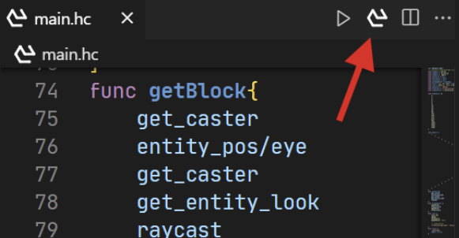

# Hex Casting VS Code Extension

This extension provides compiler, syntax highlighting(TODO) and code completion(TODO) for the Hex Casting language.

这个扩展提供了编译器、语法高亮(TODO)和代码补全(TODO)功能。

## How to compile? (如何编译？)

Just click this button. It only shows on `*.hc` file.

点击这个按钮。它只在`.hc`文件中显示。



# HexCasting Syntax Specification

## Overview (概述)

HexCasting is a domain-specific language for defining spell patterns and iota constants. Its syntax includes function
definitions, iota declarations, pattern references, and macro directives. The grammar supports numbers, vectors, lists,
boolean values, and special pattern literals(angles).

HexCasting 是一门用于定义法术和常量Iota的领域特定语言。其语法包含函数定义、iota常量声明、图案引用和宏指令，支持数值、向量、列表、布尔值以及特殊图案字面量（角度）。

## Top-Level Structure (顶层结构)

A program consists of three types of elements:

1. `iota` declarations: `iota <name> = <value>`
2. `func` definitions: `func <name> { ... }`
3. Pattern DataBase imports: `use "path/to/patterns.toml"`

程序包含三种顶层元素：

1. iota常量声明：`iota <名称> = <值>`
2. 函数定义：`func <名称> { ... }`
3. 图案数据库导入：`use "路径/图案数据库.toml"`

## Statements (语句)

- **Push Into Stacks**: `<iota>` or `&<reference>`
- **Call**: `<reference>`
- **Macro**: `#<name> ...`


- **入栈操作**：`<iota>` or `&<reference>`
- **调用操作**：`<reference>`
- **宏指令**： `#<name> ...`

## Iota Types (Iota类型)

|    Type     |                                               Syntax Example                                               |               Description                |
|:-----------:|:----------------------------------------------------------------------------------------------------------:|:----------------------------------------:|
|   Double    |                                               `3.14`, `-2e5`                                               |          Floating-point number           |
|   Boolean   |                                               `true`/`false`                                               |              Logical value               |
|    Null     |                                                   `null`                                                   |               Empty value                |
| GarbageIota |                                                 `garbage`                                                  |               Garbage Iota               |
|   Vector3   |                                             `vec<1, 2.5, -3>`                                              |              3D coordinate               |
|    List     |                                              `[1, "a", $ref]`                                              |                   List                   |
| Raw Pattern |                                               `` `wedsaq` ``                                               |           Direct pattern input           |
|    SNBT     | `<{"hexcasting:type": "hexcasting:pattern", "hexcasting:data": {"angles": [B; 4b, 4b], "start_dir": 1b}}>` | Iota of SNBT format(surrounded by `< >`) |

|   类型   |                                                    语法示例                                                    |           描述            |
|:------:|:----------------------------------------------------------------------------------------------------------:|:-----------------------:|
|  浮点数   |                                               `3.14`, `-2e5`                                               |           浮点数           |
|  布尔值   |                                               `true`/`false`                                               |           逻辑值           |
|   空值   |                                                   `null`                                                   |           空值            |
| 垃圾Iota |                                                 `garbage`                                                  |         垃圾Iota          |
|  三维向量  |                                             `vec<1, 2.5, -3>`                                              |          三维坐标           |
|   列表   |                                              `[1, "a", $引用]`                                               |           列表            |
|  原始图案  |                                               `` `wedsaq` ``                                               |         直接输入图案          |
|  SNBT  | `<{"hexcasting:type": "hexcasting:pattern", "hexcasting:data": {"angles": [B; 4b, 4b], "start_dir": 1b}}>` | SNBT格式的Iota（包围于`< >`之中） |

## References (引用类型)

- Using `<pattern_id>` to refer patterns
- Using `$<name>` to refer iota or function defined in the same file

- 使用`<图案ID>`来引用图案
- 使用`$<名称>`来引用当前文件中定义的iota或函数

## Macros (宏指令)

- `#mask <mode>`: Bookkeeper's Gambit, `mode` is a string include `*`(Delete) and `_`(Skip). For example, `#mask *_*_`
  means delete 2nd and 4th iota counting from the stack top.

- `#mask <mode>`：簿记员之策略 ，`mode`是一个字符串，包含`*`（删除）和`_`（跳过）。例如，`#mask *_*_`表示从栈顶删除第2个和第4个iota。

## Patterns DataBase (图案数据库)

It is a TOML file, list of patterns' data. For example:

这是一个TOML文件，包含图案的数据。例如：

```toml
["entity_pos/eye"]
name = "Compass' Purification"
modid = "hexcasting"
modName = "Hex Casting"
pattern = '{"hexcasting:type": "hexcasting:pattern", "hexcasting:data": {"angles": [B; 4b, 4b], "start_dir": 1b}}'
args = "entity → vector"
description = "Transforms an entity on the stack into the position of its eyes. I should probably use this on myself."
```

Currently you can get temporary data from `example/default.toml`

目前你可以从`example/default.toml`取到临时数据

## Other

- **Comments**: `// Single-line comments`
- **注释**：`// 单行注释`

